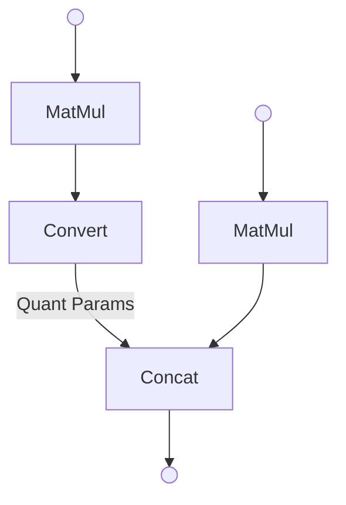
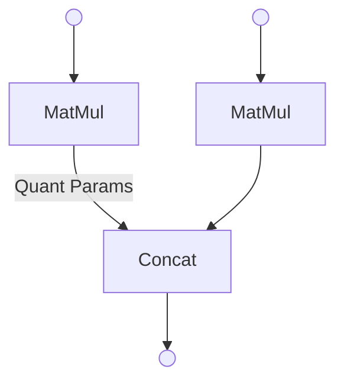
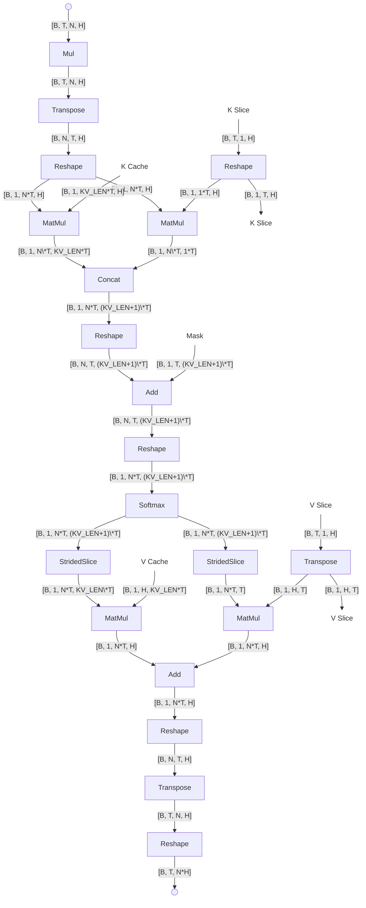
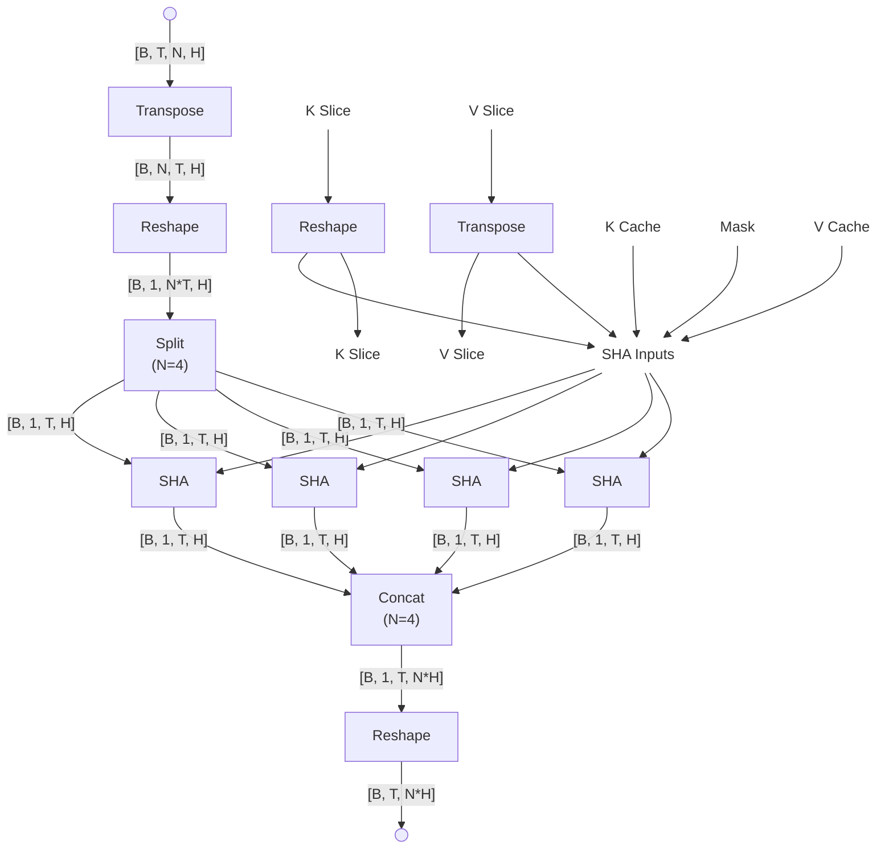
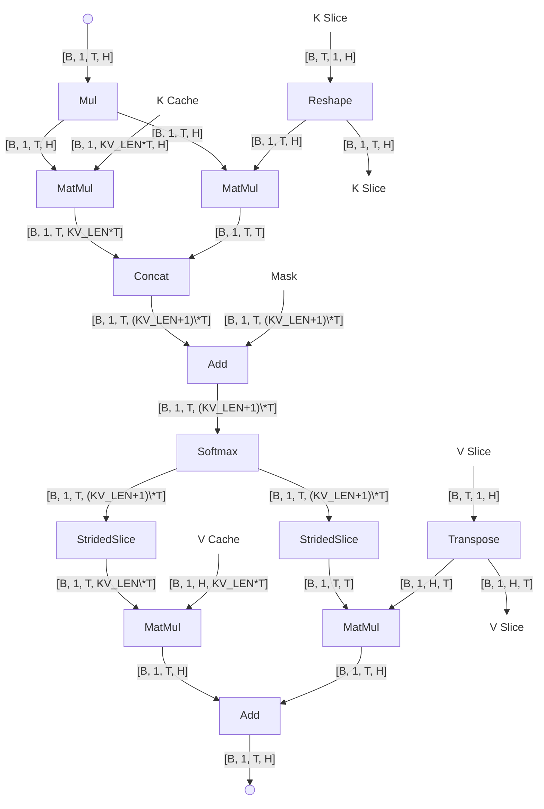

# Graph-to-graph Transformation
## Matmul-convert Fusion
Original graph:

The updated computational graph after the transformation is shown below.

## Multi-head Attention Optimization
| Dimension	| Description	| Example (Gemma3 1B) |
|:---------:|-------------|---------------------|
| B | Batch size | 1 |
| T | Sequence length | 128 for prefill / 1 for decode |
| N | Number of heads| 4 |
| H | Head dimension | 256 |
* Notation reference: [AI Edge Torch](https://github.com/google-ai-edge/ai-edge-torch)

Original MHA (Multi-head Attention) in Gemma3 prefill graph

The updated computational graph after the transformation is shown below.

with the following four SHA (Single-head Attention), based on the number of heads in MHA.

