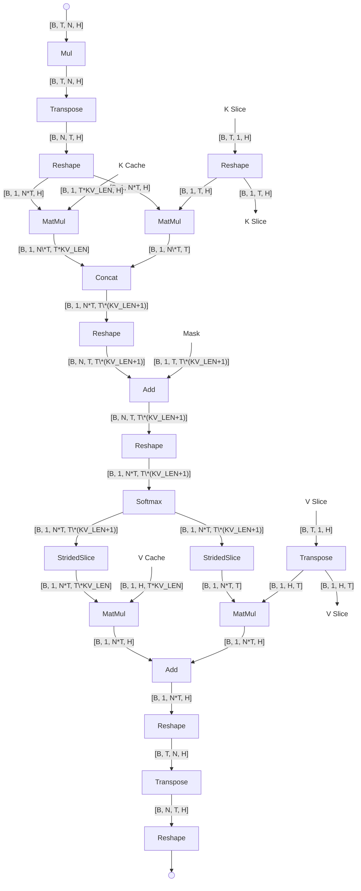
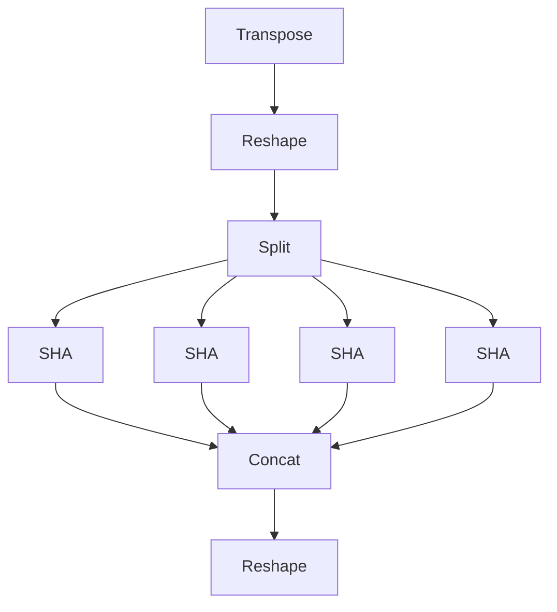
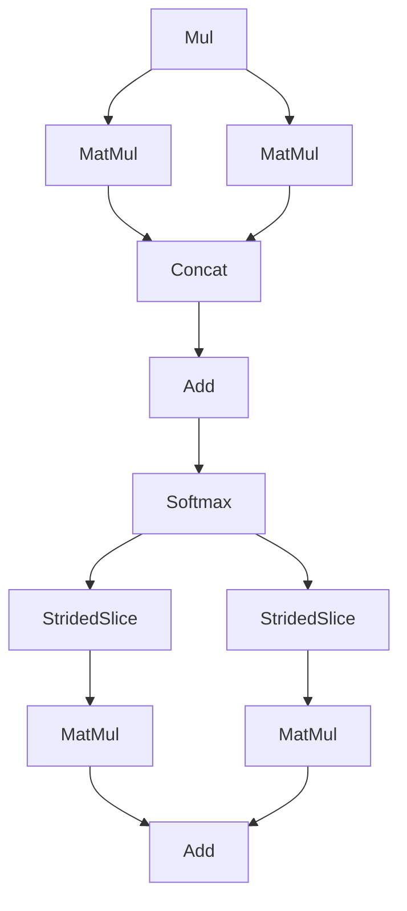

# Graph-to-graph Transformation
## MHA Optimization
|Dimension|Meaning| Gemma3 1B Example|
|:---:|---|---|
|B| Batch size| 1|
|T| Number of heads| 4|
|N| Sequence length| 128 for prefill / 1 for decode|
|H| Head dimension | 256|

Original multi-head attention in Gemma3 prefill graph

After the transformation, the graph will become 

with the following four SHA, based on the number of heads in MHA.
